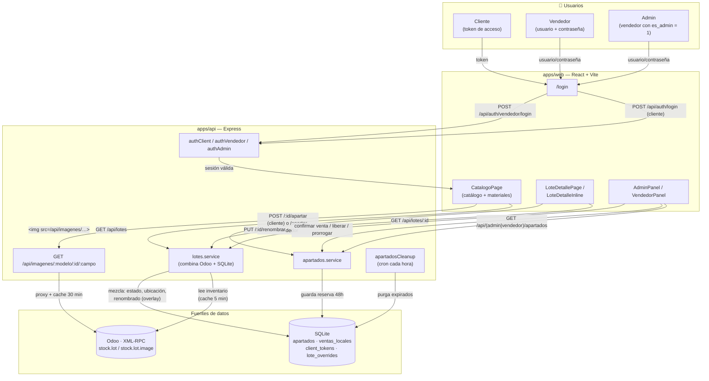
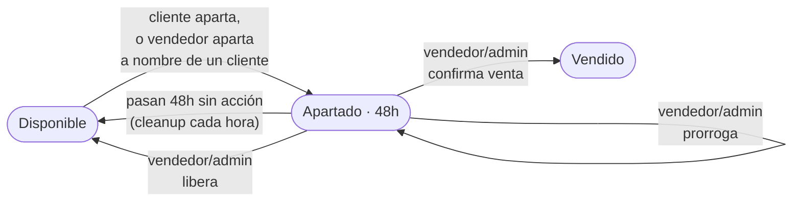
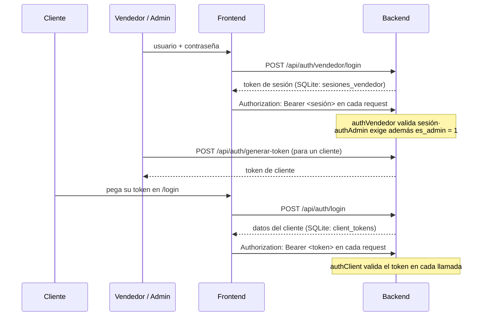

# Petravia Catálogo

Catálogo digital de láminas naturales para clientes de Petravia. Permite a los clientes consultar el inventario en tiempo real, buscar por metraje y apartar lotes. El administrador gestiona tokens de acceso y reservas desde un panel dedicado.

---

## Stack tecnológico

**Monorepo** con tres paquetes gestionados vía npm workspaces.

| Paquete | Tecnología | Propósito |
|---|---|---|
| `apps/web` | Vite + React 18 + TypeScript + Tailwind | Interfaz de usuario (catálogo y admin) |
| `apps/api` | Node.js + Express + TypeScript | API REST + proxy de imágenes |
| `packages/shared` | TypeScript puro | Tipos y utilidades compartidas |

**Fuentes de datos:**
- **Odoo** (XML-RPC) → inventario de lotes, dimensiones, imágenes (`stock.lot`, `stock.lot.image`)
- **SQLite** (better-sqlite3) → estado local: apartados, ventas confirmadas, tokens de cliente

---

## Diagrama de flujo

### Flujo general del sistema



**Cómo se arma un lote en pantalla:** el backend nunca guarda el inventario; en cada request `lotes.service` lee `stock.lot` de Odoo (con cache de 5 min) y le superpone tres capas locales guardadas en SQLite: **estado** (apartado/vendido, si hay una reserva o venta vigente), **renombrado** (si admin/vendedor corrigieron el grupo/acabado) y **ubicación**. El resultado combinado es el objeto `Lote` que consume el frontend — Odoo nunca se modifica desde el catálogo.

### Ciclo de vida de un apartado



### Autenticación



---


```
petravia-catalogo/
├── apps/
│   ├── web/                          # Frontend
│   │   └── src/
│   │       ├── pages/
│   │       │   ├── LoginPage.tsx     # Selector admin / cliente
│   │       │   ├── CatalogoPage.tsx  # Vista principal con filtros
│   │       │   ├── LoteDetallePage.tsx
│   │       │   └── AdminPage.tsx     # Panel de administración
│   │       ├── components/
│   │       │   ├── catalog/          # LoteCard, FiltrosPanel, BuscadorAvanzado, ApartarModal
│   │       │   ├── admin/            # AdminPanel (tabs: Apartados, Tokens, Catálogo)
│   │       │   └── layout/           # Layout con header contextual
│   │       ├── hooks/                # useLotes, useApartar, useBusqueda, useClientAuth
│   │       ├── lib/api.ts            # Cliente HTTP centralizado
│   │       └── store/catalogoStore.ts # Estado de filtros (Zustand)
│   │
│   └── api/                          # Backend
│       └── src/
│           ├── db/
│           │   ├── odoo.ts           # Cliente XML-RPC hacia Odoo
│           │   ├── index.ts          # Conexión SQLite
│           │   └── migrate.ts        # Schema SQLite (corre al arrancar)
│           ├── routes/
│           │   ├── lotes.ts          # GET /api/lotes, GET /api/lotes/:id, POST /api/lotes/:id/apartar
│           │   ├── auth.ts           # POST /api/auth/login, /generar-token, /tokens
│           │   ├── admin.ts          # GET /api/admin/apartados, confirmar, liberar
│           │   ├── apartados.ts      # GET /api/apartados (cliente), DELETE /api/apartados/:id
│           │   └── imagenes.ts       # GET /api/imagenes/:modelo/:id/:campo (proxy)
│           ├── services/
│           │   ├── lotes.service.ts  # Lee Odoo + overlay de estados locales (SQLite)
│           │   ├── apartados.service.ts
│           │   ├── busqueda.service.ts # Búsqueda por metraje con combos
│           │   ├── tokens.service.ts
│           │   └── admin.service.ts  # Apartados enriquecidos con datos de Odoo
│           └── middleware/
│               ├── authClient.ts     # Bearer (cliente) + Basic Auth (admin) + isAdminRequest()
│               └── apartadosCleanup.ts # Purga apartados expirados cada hora
│
└── packages/
    └── shared/
        └── src/
            ├── types.ts              # Lote, Foto, Pieza, Apartado, FiltrosCatalogo...
            └── utils.ts              # grupoMaterial(), ordenLote(), formatM2()...
```

---

## Instalación y desarrollo

### Requisitos

- Node.js v20 o superior
- Python 3.x (para scripts de diagnóstico opcionales)

### Variables de entorno

Crea `apps/api/.env` con:

```env
PORT=3000
CORS_ORIGIN=http://localhost:5173

# Odoo
ODOO_URL=https://petravia-test.odoo.com
ODOO_DB=petraviash-stg-32818560
ODOO_USER=enrique@petravia.mx
ODOO_KEY=tu_api_key_aqui

# Admin del catálogo
ADMIN_USER=admin
ADMIN_PASS=petravia123
```

### Arrancar en desarrollo

```bash
# 1. Instalar dependencias (desde la raíz del monorepo)
npm install

# 2. Levantar frontend y backend en paralelo
npm run dev
```

| Servicio | URL |
|---|---|
| Frontend (Vite) | http://localhost:5173 |
| Backend (Express) | http://localhost:3000 |

El schema de SQLite se crea automáticamente al arrancar el backend. No hay migraciones manuales.

---

## Flujo de autenticación

### Cliente

1. El administrador genera un token desde el panel (`POST /api/auth/generar-token`)
2. Le comparte el token al cliente
3. El cliente entra a `/login`, elige "Soy cliente" e ingresa el token
4. El backend valida el token en SQLite (`POST /api/auth/login`)
5. Si es válido, el frontend guarda la sesión en `localStorage` y redirige a `/catalogo`
6. Todas las requests posteriores llevan el token como `Authorization: Bearer <token>`

### Administrador

1. El admin entra a `/login`, elige "Soy administrador" e ingresa usuario y contraseña
2. Las credenciales se verifican en el frontend (hardcoded, solo para UI)
3. Se guarda una bandera en `sessionStorage`
4. Todas las requests del admin llevan `Authorization: Basic base64(usuario:contraseña)`
5. El backend verifica las credenciales en cada request protegida

> Las rutas de admin verifican `isAdminRequest()` por Basic Auth en cada llamada. No hay sesión con estado en el servidor.

---

## Datos del catálogo

### Fuente principal: Odoo XML-RPC

El backend consulta el modelo `stock.lot` de Odoo con los campos:

| Campo Odoo | Uso en catálogo |
|---|---|
| `name` | ID del lote (ej: `0000016`) |
| `product_id` | Nombre del material |
| `product_qty` | Piezas disponibles |
| `length_m` / `width_m` / `height_m` | Largo / Ancho / Grosor (cm) |
| `total_area_m2` | Saldo en m² |
| `image_ids` | IDs de `stock.lot.image` |

### Imágenes

Las fotos se almacenan en el modelo personalizado `stock.lot.image` de Odoo (campo `image_1920` para HD, `image_128` para thumb). Como Odoo bloquea la carga cross-origin desde el navegador, el backend actúa como **proxy de imágenes**:

```
Navegador → GET /api/imagenes/stock.lot.image/:id/image_128
                      ↓
            Backend → GET https://odoo.com/web/image/stock.lot.image/:id/image_128
                      ↓
            Respuesta con cache de 30 min
```

### Cache

El backend cachea los lotes de Odoo en memoria durante 5 minutos para evitar consultas XML-RPC en cada request. Las imágenes se cachean en memoria durante 30 minutos.

### Estado local: SQLite

Odoo no maneja los estados de reserva del catálogo. SQLite guarda:

| Tabla | Contenido |
|---|---|
| `apartados` | Reservas temporales de 48h por cliente |
| `ventas_locales` | Lotes marcados como vendidos desde el panel (mientras Odoo se actualiza) |
| `client_tokens` | Tokens de acceso de clientes |

Al servir los lotes, el backend mezcla los datos de Odoo con el estado local: si un lote tiene una reserva vigente en SQLite, su estado se sobreescribe a `apartado`; si está en `ventas_locales`, a `vendido`.

---

## API REST

### Lotes

| Método | Ruta | Descripción | Auth |
|---|---|---|---|
| GET | `/api/lotes` | Lista con filtros y paginación | Pública (clientes solo ven `disponible`) |
| GET | `/api/lotes/:id` | Detalle de un lote | Pública (clientes no ven apartados/vendidos) |
| GET | `/api/lotes/buscar` | Búsqueda por metraje con combos | Pública |
| GET | `/api/lotes/filtros/materiales` | Lista de materiales únicos | Pública |
| GET | `/api/lotes/filtros/grupos` | Lista de grupos únicos | Pública |
| POST | `/api/lotes/:id/apartar` | Reservar un lote 48h | Cliente (Bearer) |

### Autenticación

| Método | Ruta | Descripción | Auth |
|---|---|---|---|
| POST | `/api/auth/login` | Validar token de cliente | — |
| POST | `/api/auth/generar-token` | Crear token para cliente | Admin |
| GET | `/api/auth/tokens` | Listar tokens | Admin |
| DELETE | `/api/auth/tokens/:id` | Desactivar token | Admin |

### Administración

| Método | Ruta | Descripción | Auth |
|---|---|---|---|
| GET | `/api/admin/apartados` | Listar apartados (con datos de Odoo) | Admin |
| POST | `/api/admin/apartados/:id/confirmar` | Confirmar venta | Admin |
| DELETE | `/api/admin/apartados/:id` | Liberar reserva | Admin |
| GET | `/api/admin/estadisticas` | Resumen de apartados | Admin |

### Apartados del cliente

| Método | Ruta | Descripción | Auth |
|---|---|---|---|
| GET | `/api/apartados` | Mis reservas vigentes | Cliente |
| DELETE | `/api/apartados/:id` | Cancelar mi reserva | Cliente |

### Imágenes

| Método | Ruta | Descripción | Auth |
|---|---|---|---|
| GET | `/api/imagenes/:modelo/:id/:campo` | Proxy de imagen desde Odoo | — |

---

## Búsqueda avanzada por metraje

La búsqueda avanzada permite al cliente indicar un material/grupo y un metraje requerido. El sistema devuelve:

1. **Lotes individuales** que por sí solos cubren el metraje (ordenados por menor excedente)
2. **Combinaciones de 2 o 3 lotes** que juntos suman el metraje requerido (±20% de tolerancia)

Los resultados son clickeables para ver el detalle, y se pueden seleccionar múltiples lotes para apartarlos en una sola acción.

---

## Apartado de lotes

- Un cliente puede apartar cualquier lote disponible completo (no por metraje parcial)
- La reserva dura **48 horas**
- El lote aparece como `apartado` en el catálogo (invisible para otros clientes)
- El admin puede confirmar la venta (pasa a `vendido`) o liberar la reserva desde el panel
- Los apartados expirados se limpian automáticamente cada hora

---

## Roadmap

- [ ] Notificaciones por email al apartar / al confirmar venta
- [ ] Sincronización automática de estado vendido de vuelta a Odoo
- [ ] Subida de fotos al lote desde el panel admin (sin entrar a Odoo)
- [ ] Autenticación admin con JWT en lugar de Basic Auth hardcoded
- [ ] Deploy: frontend en Cloudflare Pages, backend en Railway/Fly.io
- [ ] PWA para uso offline en almacén